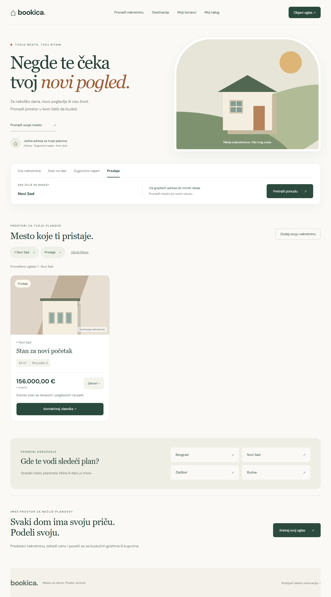
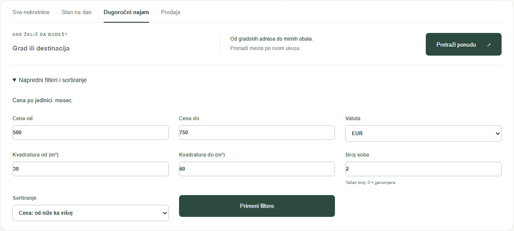
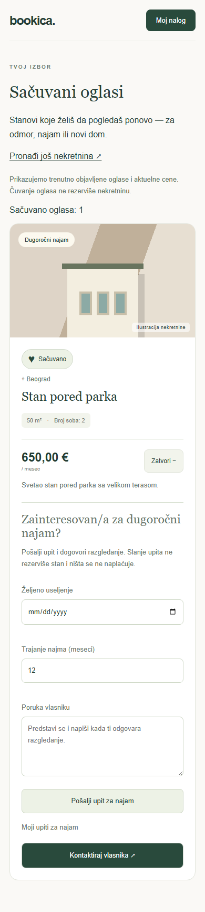
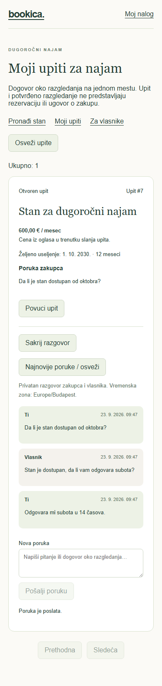
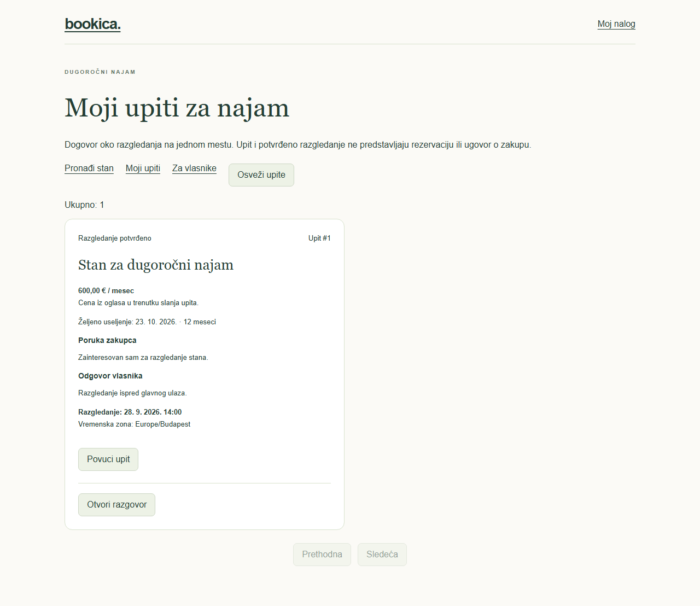
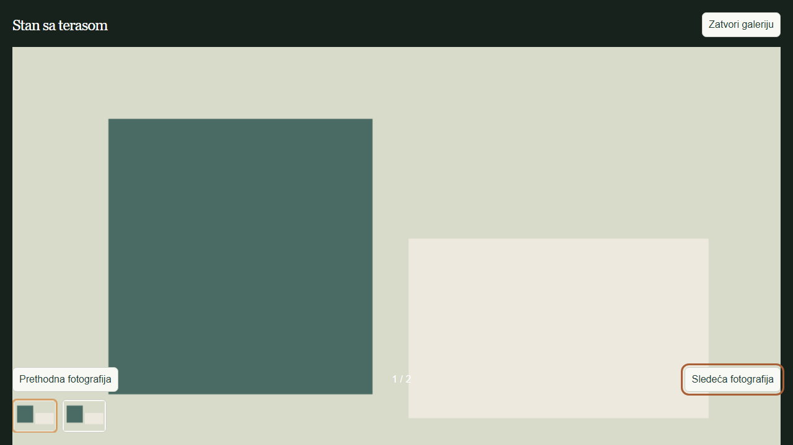

# Bookica

**A place to stay. A space to call home.**

Bookica is a property marketplace **under active development**. It brings apartment sales, long-term rentals and short stays into one application—from finding a new home to booking a few nights in the city, mountains or by the sea.

The project started as a general booking platform. It is now being developed around real estate, reusing its authentication, owner tools and reservation infrastructure. The original hourly booking application remains available at `/booking`.

[What works today](#what-works-today) · [Roadmap](#roadmap) · [Run locally](#run-locally) · [Documentation](#documentation)

## Preview



*Screenshots show the actual interface with deterministic test data, not live listings or real user conversations. Property illustrations and gallery images are test placeholders, not photographs of real apartments.*

### Advanced property search

Filter by city, offer type, price, floor area and exact room count, then sort by newest, price or largest area. Price comparisons stay within the selected offer type and currency.



<details>
<summary>Saved listings and private rental conversations — mobile</summary>

Save a property to revisit it later, or continue a private conversation with its owner from your rental inquiry.




</details>

<details>
<summary>Confirmed property viewing</summary>

Owners propose a viewing time and tenants confirm it from their inquiry. A viewing does not create a reservation or a lease.



</details>

<details>
<summary>Full-screen property gallery</summary>

Owners can upload up to 12 images and select their cover. Visitors browse the gallery with thumbnails, navigation buttons or keyboard arrows. The geometric images below are browser-test fixtures.



</details>

## What Bookica is being built to do

| Offer | Intended experience | Current implementation |
| --- | --- | --- |
| Short stays | Find and reserve an entire apartment for a city break or holiday | Availability calendar, nightly quotes, confirmation and cancellation; payment at the property |
| Long-term rentals | Find a home, contact the owner and arrange a viewing | Published listings, monthly prices, private conversations, viewing proposals and confirmations |
| Apartment sales | Explore properties, compare details and contact sellers | Published listings, total asking prices, search and email contact |

The goal is one place for property discovery and owner management, with a reservation flow for short stays. Long-term rentals use private inquiries; sales listings currently use email contact. Neither is purchased through the short-stay checkout.

## What works today

### Property marketplace

- Owners can create, edit, publish and withdraw listings, or keep them as private drafts.
- Listings include city, description, floor area, room count, price, currency and a public contact email.
- Visitors can search by city and offer type, filter by price, floor area and exact room count (including studios), and sort by newest, price or largest area.
- Price filters and sorting require an offer type and currency so nightly, monthly and sale prices are not mixed. Applied filters stay active across result pages and can be cleared together.
- Search filters and pagination persist in the URL, survive reload and browser Back/Forward, and can be shared using **Kopiraj link pretrage**.
- Each listing has a shareable `/properties/{id}` page with photos, description, saving, owner contact and the relevant booking or inquiry form. Click its title in the catalog or saved listings to open it.
- Signed-in users can save listings of any offer type and revisit them on `/saved`, with current prices and direct access to booking or rental inquiries.
- Owners can upload up to 12 photos per listing, select a cover, reorder and delete them; visitors can open a full-screen gallery on desktop and mobile.
- The responsive storefront includes mobile navigation, active filters and loading, empty and error states.
- Contact links open the visitor's email application; long-term rentals also offer private inquiries stored in Bookica.

### Nightly reservations

- Owners explicitly enable booking and set the maximum number of guests, minimum nights and property timezone.
- Guests choose arrival, departure and guest count, view occupied nights and request a server-calculated quote.
- Visitors can filter short-stay search results by arrival, departure and guest count. Matching listings respect confirmed stays, capacity, minimum nights and the property's local booking window; the selection prefills booking forms.
- Confirmation rechecks price and availability. A reservation occupies the entire apartment, regardless of guest count.
- PostgreSQL transaction locks protect against simultaneous overlapping reservations. Repeated requests return the existing reservation.
- Guests can view their stays and cancel for free before the arrival date in the property's timezone.
- Owners can view reservations and guest contact details.
- Owners can block dates for maintenance, personal use or off-platform bookings from **Zauzetost** in the listing manager. Blocks affect all listings for the same apartment, availability search and booking confirmation.
- Guests and owners can download confirmed stays as `.ics` calendar events. The export is a one-time copy; changes and cancellations must also be updated in the external calendar.

**Short-stay reservations currently use payment at the property.** There is no online charge, deposit or payment hold for these stays. The existing hourly booking payment integration has not yet been connected to nightly reservations.

### Long-term rentals

- Signed-in tenants send private inquiries with a move-in date, duration and message.
- Owners reply and propose viewing times; tenants accept, decline or withdraw.
- Both participants can download a confirmed viewing as an `.ics` calendar event with its agreed time.
- Tenants and owners exchange private messages, retain conversation and viewing history, and track unread messages.
- Both sides track inquiries in their own inbox, with protection against duplicate submissions and stale updates.
- Inquiries do not reserve apartments or create leases or payments. See the [long-term rental guide](docs/long-term-rentals.md).

### Existing foundation

Email/password login, Google OAuth, customer/owner/admin roles and database migrations are already part of the application. The original hourly platform also retains its reservations, payment workflows, reviews, favorites, notifications and operational tools. Those features are not all available for property listings yet.

## Roadmap

The next development areas are:

- [x] Property photographs, cover selection and galleries.
- [x] Dedicated property pages and shareable listing links.
- [ ] Seasonal nightly pricing and more flexible booking rules.
- [x] Local check-in/check-out times for nightly stays, preserved on reservations.
- [x] Owner daily arrivals/departures, reservation filters and block-management shortcuts.
- [x] Owner calendar blocks for whole-apartment stays.
- [ ] Synchronization with external booking calendars.
- [ ] Online payments and deposits for short stays.
- [x] Long-term rental inquiries and viewing proposals.
- [ ] Leases, monthly rental payments and richer sales workflows.
- [x] Private saved property listings.
- [x] Private rental conversations, message history and unread indicators.
- [x] Advanced property filters and sorting.
- [x] Short-stay availability search by dates and guest count.
- [x] Shareable searches with URL filters and browser-history navigation.
- [x] Calendar downloads for confirmed stays and viewings.
- [ ] Property reviews and map search.
- [ ] Guest notifications, rescheduling and more complete host operations.

These are planned features, not claims about the current release. Bookica is still being built and is not presented as a finished real-estate platform.

## Try the current flow

| Page | Purpose |
| --- | --- |
| `/` | Property search and listing details |
| `/properties/{id}` | Shareable property page, gallery, booking or rental inquiry |
| `/saved` | User's saved property listings |
| `/owner` | Existing owner workspace, property editor and nightly booking settings |
| `/rentals` | Tenant rental inquiries and viewing confirmations |
| `/owner/rentals` | Owner replies and viewing proposals |
| `/stays` | Guest's nightly reservations and cancellation |
| `/owner/stays` | Owner's apartment reservations and guest contact |
| `/account` | Account access and original booking dashboard |
| `/booking` | Original hourly booking storefront |

To publish your first property:

1. Sign in with an existing `owner` or `admin` account and open `/owner`.
2. Create an object using **Add venue**, then select **Novi oglas** under **Tvoji oglasi**.
3. Enter the property details and save a draft or check **Objavi oglas** to publish it.
4. For short stays, set the booking rules and explicitly enable whole-apartment reservations.
5. Use **Fotografije** on the saved listing to upload images, choose the cover and arrange their order. Configure private photo storage first; see the [photo guide](docs/property-photos.md).
6. Open the listing on `/`. For a short stay, check dates and price and confirm from a guest account. For a long-term rental, send an inquiry and continue from `/rentals`.

The catalog starts empty; real listings are not automatically seeded. Each bookable venue represents one whole apartment. Multiple ads for that venue share occupancy. Hourly resources and nightly apartments must use separate venues.

See the [property guide](docs/property-marketplace.md) and [nightly booking guide](docs/nightly-stays.md) for the complete rules and limitations.

## Technology

| Layer | Stack |
| --- | --- |
| Frontend | React, TypeScript, Vite |
| API | Python 3.12, FastAPI, Pydantic |
| Persistence | PostgreSQL, SQLAlchemy, Alembic |
| Background jobs | Celery, Redis |
| Local services | Docker Compose, MailHog, MinIO |
| Checks | pytest, Ruff, Vitest, ESLint, TypeScript, Playwright |

## Run locally

### Docker Compose

Requirements: Docker and Docker Compose.

The Compose stack expects a root `.env.docker` file. This file is not tracked; create it from `.env.example` if it does not already exist, then configure the service addresses for Docker: PostgreSQL host `postgres`, Redis host `redis`, SMTP host `mailhog`, and the corresponding database/Celery URLs. Keep browser-facing frontend and OAuth URLs on `localhost`.

```bash
docker compose up --build
```

In another terminal, apply migrations:

```bash
docker compose exec backend alembic upgrade head
```

- Frontend: <http://localhost:5173>
- API documentation: <http://localhost:8000/docs>
- MailHog: <http://localhost:8025>
- MinIO console: <http://localhost:9001>

### Backend without Docker

Requirements: Python 3.12, PostgreSQL and Redis. From the repository root on Windows:

```powershell
python -m venv .venv
.venv\Scripts\Activate.ps1
pip install -r requirements.txt
if (!(Test-Path .env)) { Copy-Item .env.example .env }
```

Edit `.env` for your local database and services, then run:

```powershell
alembic upgrade head
uvicorn app.main:app --reload
```

### Frontend

Use Node.js 22.12 or later (CI uses Node.js 22). From `frontend`:

```bash
npm ci
npm run dev
```

Vite proxies `/api` to `http://localhost:8000`. Use `frontend/.env.example` as a template only if you need to override the API or proxy target. Keep local environment files out of Git.

Apply `alembic upgrade head` before starting a newer API version against an existing database. New nightly booking settings default to disabled; owners opt in after reviewing their listings.

## Validation

Backend, from the repository root with the virtual environment active:

```bash
pytest
ruff check .
ruff format --check .
```

For PostgreSQL concurrency tests, use a development database configured in `.env`:

```powershell
$env:STAY_TEST_POSTGRES = "1"
pytest tests/test_stays.py
```

The concurrency test creates and removes a uniquely named test schema. CI runs it along with the migration chain and backend suite.

Frontend, from `frontend`:

```bash
npm run lint
npm test
npm run build
npx playwright install chromium
npm run test:e2e
```

Browser tests use deterministic API fixtures. Backend tests separately verify persistence, permissions, pricing, cancellation and concurrent reservations.

## Project structure

```text
app/
  api/routers/       HTTP endpoints and authorization dependencies
  models/            Database models
  schemas/           Request and response contracts
  repositories/      Database queries and locking
  services/          Business rules and reservation workflows
  tasks/             Background jobs
alembic/             Versioned database migrations
frontend/src/
  PropertyHome.tsx   Property storefront
  PropertyManager.tsx  Owner listing editor
  PropertySearchFilters.tsx  Advanced search and sorting
  PropertyGallery.tsx  Public listing photo gallery
  SavedPropertiesPage.tsx  Saved property listings
  StayBooking.tsx    Nightly calendar, quote and confirmation
  StaysPage.tsx      Guest and owner stay views
  App.tsx           Original hourly booking application
  api.ts            Typed API client
frontend/e2e/        Browser workflow tests
tests/               Backend tests
docs/                Feature guides and interface preview
```

## Documentation

- [Property marketplace](docs/property-marketplace.md): publishing, offer types and listing APIs.
- [Property photos](docs/property-photos.md): uploads, galleries, private storage and deployment.
- [Property search](docs/property-search.md): price and area ranges, room counts, sorting and currency rules.
- [Property detail pages](docs/property-detail-pages.md): direct links, sharing, deployment and targeted code cleanup.
- [Calendar downloads](docs/calendar-downloads.md): exporting confirmed stays and viewings, time handling and import limitations.
- [Owner calendar blocks](docs/owner-stay-blocks.md): private unavailability, shared inventory, conflict handling and deployment.
- [Arrival and departure times](docs/stay-times.md): nightly-only rules, reservation snapshots and deployment.
- [Owner reservation overview](docs/owner-stay-overview.md): daily counts, filters, timezone rules and block shortcuts.
- [Saved properties](docs/property-marketplace.md#saved-properties): saving, removing and revisiting published listings.
- [Long-term rentals and conversations](docs/long-term-rentals.md): private inquiries, viewing confirmations, message history and unread indicators.
- [Nightly stays](docs/nightly-stays.md): activation, date rules, inventory, payment terms and reservation APIs.
- [Google login setup](GOOGLE_LOGIN_SETUP.md): OAuth configuration.
- [Analytics pipeline](docs/analytics-data-pipeline.md): existing booking analytics infrastructure.
- [Demand forecasting](docs/demand-forecasting.md): existing forecasting implementation.

The running API's `/docs` page is the reference for request bodies, responses and authentication requirements.
