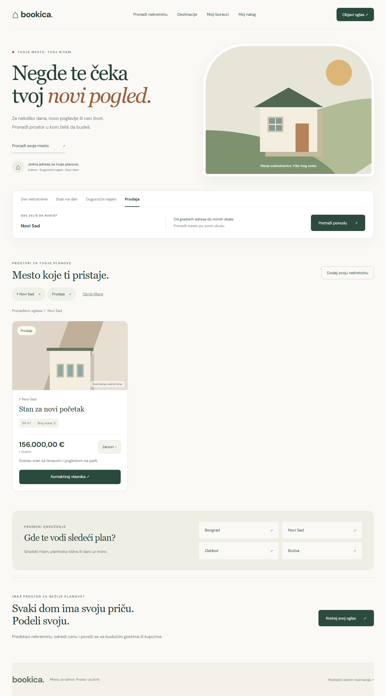
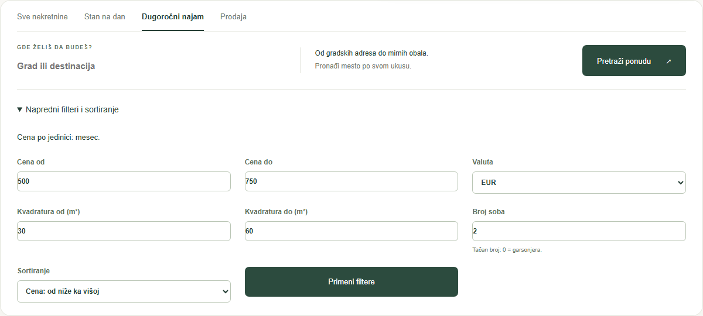
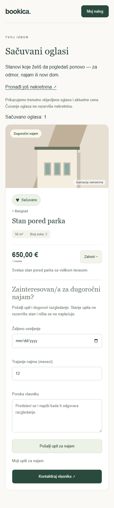
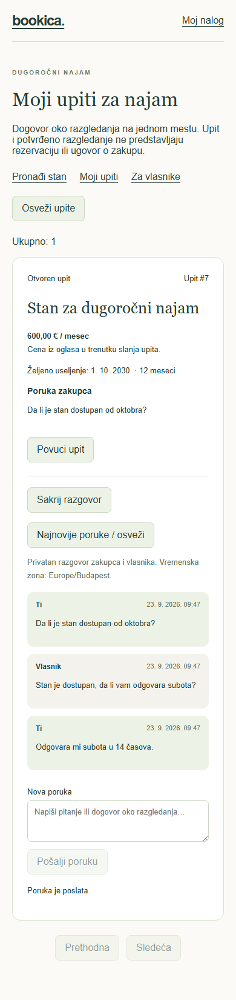
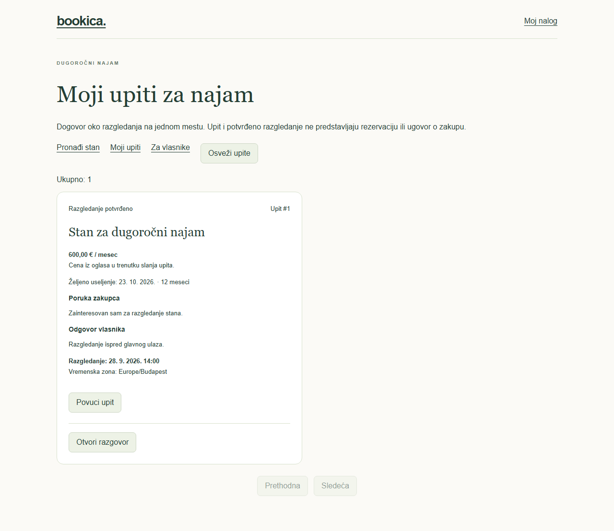
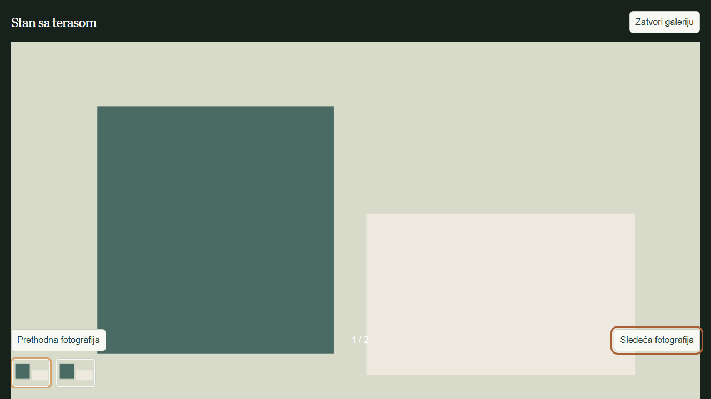
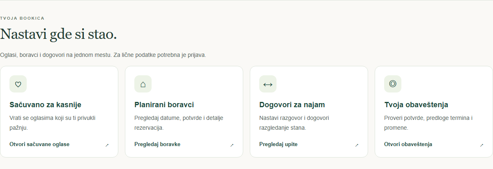
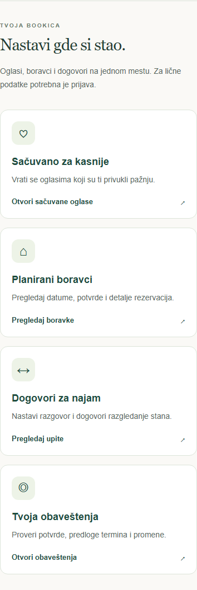
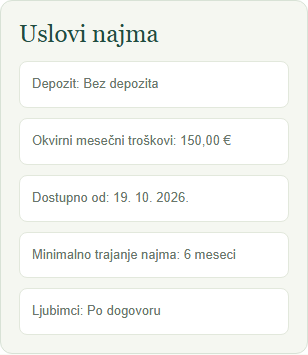

# Bookica

**A place to stay. A space to call home.**

Bookica is a property marketplace **under active development**. It brings apartment sales, long-term rentals and short stays into one application—from finding a new home to booking a few nights in the city, mountains or by the sea.

The project started as a general booking platform. It is now being developed around real estate, reusing its authentication, owner tools and reservation infrastructure. The original hourly booking application remains available at `/booking`.

[What works today](#what-works-today) · [Hosting readiness](#hosting-readiness) · [Roadmap](#roadmap) · [Run locally](#run-locally) · [Documentation](#documentation)

## Preview



*Screenshots show the actual interface with deterministic test data, not live listings or real user conversations. Property illustrations and gallery images are test placeholders, not photographs of real apartments.*

### Advanced property search

Filter by city, offer type, price, floor area and exact room count, then sort by newest, price or largest area. Price comparisons stay within the selected offer type and currency.



<details>
<summary>Saved listings and private rental conversations — mobile</summary>

Save a property to revisit it later, or continue a private conversation with its owner from your rental inquiry.




</details>

<details>
<summary>Confirmed property viewing</summary>

Owners propose a viewing time and tenants confirm it from their inquiry. A viewing does not create a reservation or a lease.



</details>

<details>
<summary>Full-screen property gallery</summary>

Owners can upload up to 12 images and select their cover. Visitors browse the gallery with thumbnails, navigation buttons or keyboard arrows. The geometric images below are browser-test fixtures.



</details>

### Your Bookica and rental terms

Homepage shortcuts bring saved listings, stays, rental inquiries and notifications together. Rental terms are grouped for easier reading on desktop and mobile; historical inquiries keep the terms from submission.



<details>
<summary>Mobile shortcuts and rental conditions</summary>




</details>

## What Bookica is being built to do

| Offer | Intended experience | Current implementation |
| --- | --- | --- |
| Short stays | Find and reserve an entire apartment for a city break or holiday | Availability calendar, nightly quotes, confirmation and cancellation; payment at the property |
| Long-term rentals | Find a home, contact the owner and arrange a viewing | Published listings, monthly prices, rental terms, private conversations, viewing proposals, confirmations and in-app notifications |
| Apartment sales | Explore properties, contact sellers and arrange a viewing | Published listings, total asking prices, private inquiries, conversations and confirmed viewings |

The goal is one place for property discovery and owner management, with a reservation flow for short stays. Long-term rentals and sales use private inquiries and viewing appointments. Neither is purchased through the short-stay checkout.

## What works today

### Property marketplace

- Owners can create, edit, publish and withdraw listings, or keep them as private drafts.
- The owner editor offers live completeness hints for photos, description, contact, property details and long-term rental terms, with shortcuts to missing fields. These recommendations add no publishing restrictions; photos are managed after the first save.
- Owners can open **Pregled oglasa** to inspect saved drafts, protected photo previews, asking prices and rental/stay terms before publication. Preview is read-only and does not count as a public listing view.
- Listings include city, description, floor area, room count, price, currency and a public contact email.
- Optional property details include apartment/house type, neighborhood, floor, heating, furnishing, elevator, parking and terrace. Visitors can view and filter by these details; unspecified values stay unknown.
- Visitors can search by city and offer type, filter by price, floor area and exact room count (including studios), and sort by newest, price or largest area.
- Visitors can search an area on an optional map using the same filters and availability checks. Owners explicitly choose an approximate public location; existing listings remain off-map by default. Map bounds work in shared URLs and saved searches. See [map search and location privacy](docs/property-map-search.md).
- Visitors can compare up to three listings of the same offer type and currency from search results. Selection survives filtering and pagination until the page is reloaded. The mobile-scrollable table compares asking/base prices, property details and relevant rental/stay terms; unknown values remain explicit. Comparison uses data from selection time, so current terms and date-specific nightly prices should be checked on the listing.
- Price filters and sorting require an offer type and currency so nightly, monthly and sale prices are not mixed. Applied filters stay active across result pages and can be cleared together.
- Search filters and pagination persist in the URL, survive reload and browser Back/Forward, and can be shared using **Kopiraj link pretrage**.
- Visitors can name and save up to 10 searches in the current browser, reopen their filters from page one, rename matching searches or remove them. These searches persist across reloads without login; they are local to the browser profile and do not send alerts. Saved dates remain unchanged. See [saved searches](docs/saved-searches.md).
- Signed-in visitors can additionally keep 10 private searches on their account, accessible on other devices. Local searches transfer only when explicitly selected, and account changes can be refreshed without altering the local copies.
- Account searches offer optional in-app alerts for newly published matching listings, with an independent on/off preference for each search and direct listing links in the notification inbox. See [saved-search alerts](docs/saved-search-alerts.md) for matching rules and worker setup.
- Each listing has a shareable `/properties/{id}` page with photos, description, saving, owner contact and the relevant booking or inquiry form. Click its title in the catalog or saved listings to open it.
- Signed-in users can save listings of any offer type and revisit them on `/saved`, with current prices and direct access to booking or rental inquiries.
- Owners can upload up to 12 photos per listing, select a cover, reorder and delete them; visitors can open a full-screen gallery on desktop and mobile.
- The responsive storefront includes mobile navigation, active filters and loading, empty and error states.
- Keyboard users can press Tab to reveal **Preskoči na sadržaj**, then Enter to focus the main content without traversing navigation or changing the current search URL.
- Contact links open the visitor's email application; long-term rentals and sales also offer private inquiries stored in Bookica.

### Nightly reservations

- Owners explicitly enable booking and set the guest capacity, minimum/maximum nights and property timezone.
- Owners can also set advance notice for arrival and a departure horizon, enforced in search and booking using local calendar dates. See [booking windows](docs/booking-windows.md).
- Owners can require 0–7 preparation days between stays. Search, booking and the calendar apply the longest gap among booking-enabled listings of the same apartment. See [preparation gaps](docs/preparation-gaps.md).
- Guests choose arrival, departure and guest count, view occupied nights and request a server-calculated quote.
- Owners can set up to 24 seasonal price periods. Guests see an itemized nightly quote; confirmed stays retain the original prices. With dates, search filters use the average nightly amount and cards show the stay total. See [seasonal pricing](docs/seasonal-pricing.md).
- Visitors can filter short-stay search results by arrival, departure and guest count. Matching listings respect confirmed stays, capacity, minimum nights and the property's local booking window; the selection prefills booking forms.
- Confirmation rechecks price and availability. A reservation occupies the entire apartment, regardless of guest count.
- PostgreSQL transaction locks protect against simultaneous overlapping reservations. Repeated requests return the existing reservation.
- Guests can view their stays and cancel for free before the arrival date in the property's timezone.
- Owners can view reservations and guest contact details.
- Guests and owners receive private in-app notifications for nightly confirmations and cancellations, with links to their reservation lists. The [notification inbox](docs/stay-notifications.md) supports refresh, older pages and read/dismiss actions.
- Owners can open `/owner/analytics` for listing detail views and monthly confirmed/cancelled reservations, nights and booked value, filtered by year and listing. Currencies remain separate; booked value is not recorded payment income.
- Guests can rate and review confirmed stays after checkout day. Published nightly listings show paginated reviews and an overall average without exposing guest identity or stay dates.
- Owners can block dates for maintenance, personal use or off-platform bookings from **Zauzetost** in the listing manager. Blocks affect all listings for the same apartment, availability search and booking confirmation.
- Guests and owners can download confirmed stays as `.ics` calendar events. The export is a one-time copy; changes and cancellations must also be updated in the external calendar.

**Short-stay reservations currently use payment at the property.** There is no online charge, deposit or payment hold for these stays. The existing hourly booking payment integration has not yet been connected to nightly reservations.

### Long-term rentals

- Signed-in tenants send private inquiries with a move-in date, duration and message.
- Owners reply and propose viewing times; tenants accept, decline or withdraw.
- Both participants can download a confirmed viewing as an `.ics` calendar event with its agreed time.
- Tenants and owners exchange private messages, retain conversation and viewing history, and track unread messages.
- Both sides track inquiries in their own inbox, with protection against duplicate submissions and stale updates.
- Inquiries do not reserve apartments or create leases or payments. See the [long-term rental guide](docs/long-term-rentals.md).
- Long-term listings can specify a deposit, estimated monthly bills, availability date, minimum lease duration and pets policy. Inquiries validate the date/duration and retain the original terms for both participants.

### Property sales

- Buyers send private inquiries from sale listings, without move-in dates or rental terms.
- Buyers use `/sales`; sellers use `/owner/sales` to reply, propose viewings and close inquiries. Buyers can confirm, decline or withdraw.
- Conversations include message history and unread indicators; viewing milestones create private in-app notifications. Confirmed viewings can be downloaded to a calendar.
- Inquiries retain the original asking price and currency. Duplicate requests and stale viewing updates are protected; rental and sale histories remain separate.
- Applies to both apartments and houses offered for sale. Inquiries do not reserve a property, create a purchase contract or collect payments. See [sales inquiries](docs/sales-inquiries.md).

### Existing foundation

Email/password login, Google OAuth, customer/owner/admin roles and database migrations are already part of the application. The original hourly platform also retains its reservations, payment workflows, reviews, favorites, notifications and operational tools. Those features are not all available for property listings yet.

## Hosting readiness

**Initial assessment: 5 October 2026, based on `6acfa46`; registration/provisioning status updated 6 October 2026.** The application is a working marketplace suitable for a portfolio demonstration after the launch preparation below. It is **not yet ready for unrestricted public registration and real customer operations**. This is a source/configuration review, not a penetration test or verification of a running hosting environment.

| Target | Current assessment | Release gate |
| --- | --- | --- |
| Portfolio page with screenshots, description and GitHub link | Can be published now | Describe it as a project/demo; no running backend is needed |
| Live interactive demo linked from your site | Feasible after P0 | Isolated sample data, secure deployment, controlled access and a tested demo flow |
| Public beta with real owners, guests and inquiries | Not yet | Complete P0 and P1 and pass staging acceptance |
| Online nightly payments / full commercial operation | Later scope | Beta readiness plus payment-specific integration and operational validation |

For a live demo, use a dedicated subdomain such as `bookica.your-domain.example` and link to it from the portfolio. The app currently assumes root-relative routes (`/properties`, `/owner`, `/api`); hosting under a path such as `/projects/bookica/` needs router, asset and API-path work. Static frontend hosting alone does not run FastAPI, PostgreSQL, Redis, Celery or photo storage.

The existing foundation includes backend/frontend builds, migrations, PostgreSQL concurrency tests, role checks, property moderation, `/health`, database `/ready`, and scheduled jobs. Passing CI verifies those tested behaviors; it does not prove production configuration, recovery or public abuse resistance.

### Findings that drive the launch plan

- **Public account provisioning is now restricted.** Public signup creates customers only; owner/admin input is rejected and the service cannot derive privileges from registration input. Trusted operators assign or revoke roles using a preview-first CLI that invalidates existing sessions/API keys. See [account provisioning](docs/account-provisioning.md). Existing deployments still require a review of privileged accounts created before this fix.
- **Development and production profiles are now separate.** [Development Compose](docker-compose.yml) retains local tooling. The [production profile](compose.production.yml) uses built images, private services, controlled migrations and an unprivileged frontend proxy; see its [deployment guide](docs/production-profile.md). It has not provisioned or validated an actual public host.
- **Production image isolation has an initial implementation.** Production Dockerfiles copy selected application files and use non-root users; [.dockerignore](.dockerignore) excludes environment files and local artifacts. Full secret scanning and production placeholder-secret rejection remain on the roadmap.
- **Email and account recovery are partial.** Password-reset endpoints and single-use token handling exist, but the email currently contains a raw token, the frontend has no reset flow, and [EmailService](app/services/email_service.py) has no SMTP authentication/STARTTLS support. Choose a secure relay/provider integration rather than only changing the SMTP hostname.
- **Hosted operational evidence is still missing.** A real-stack container smoke workflow now checks the deployment profile alongside mocked browser tests. Production backup/restore, automated release/rollback and actual host acceptance are not implemented. `/ready` checks the database only; workers, scheduler, Redis and object storage need operational checks.
- **Public signup/abuse controls need a dedicated pass.** No application rate limiter was found for login, reset, inquiries or uploads. Password signup has no email-verification flow; Google identity verification is separate. Browser bearer tokens currently live in `localStorage`, so session/token handling and XSS defenses need review before real-user rollout.

## Roadmap

Launch preparation now takes priority over additional marketplace features. Check off an item only after its acceptance criterion is demonstrated. Infrastructure already configured outside this repository must be verified before marking it complete.

### P0 — Before an internet-accessible interactive demo

- [x] **Secure registration and role provisioning.** Customer-only public signup, service-level enforcement, regression tests and a controlled operator CLI for owner/admin changes are implemented. Applied changes invalidate existing sessions/API keys. See [operator instructions](docs/account-provisioning.md).
- [ ] **Review pre-fix deployments, if any were exposed.** Audit existing privileged accounts and their activity; demote unapproved accounts and revoke compromised credentials. This is an environment-specific operator task, not an automatic migration.
- [x] **Create a production deployment profile.** A standalone Compose profile builds/serves static frontend assets, runs the API without reload/source mounts, gates startup on migrations/readiness, and defines restart/resource/private-network settings. A real-stack container smoke workflow validates it. See [production profile](docs/production-profile.md); actual hosting and operational acceptance remain below.
- [ ] **Protect build context and secrets.** Exclude `.env.*` (except intentional templates), credentials, `.tools` and local artifacts from images; run containers with a non-root application user. Supply secrets at runtime and fail production startup on placeholder secrets. Confirm that neither image contents nor frontend bundles contain secrets.
- [ ] **Wire domain, HTTPS and routes.** Configure DNS/certificates, static-file caching, `/api` proxying and direct page reloads. Verify `FRONTEND_ORIGINS`, `FRONTEND_URL`, build-time `VITE_API_URL` and any Google callback URL. If Google login is enabled, verify secure OAuth state cookies and their path through the proxy; otherwise hide unconfigured providers.
- [ ] **Provision persistent services and migrations.** Create PostgreSQL, Redis and private property-photo storage with dedicated credentials; run `alembic upgrade head` as a controlled release step. Run/supervise Celery worker and one Beat scheduler when background features are enabled. Confirm photos and database records survive container restarts, and saved-search alerts run outside a developer terminal.
- [ ] **Prepare an isolated portfolio demo.** Seed realistic fictional listings, demo accounts and owned/licensed photos; display a demo label, disable real charges and outgoing production integrations, set upload/storage limits and document reset behavior. Do not share a production administrator account with visitors. Keep demo data and credentials separate from future customer data.
- [ ] **Prove the hosted flow.** On the deployed HTTPS URL, exercise login, owner listing/photo publication, search/map, a nightly reservation, competing booking rejection, cancellation, a rental/sales inquiry and notification delivery against the real API/database. Check mobile layout, direct deep links and service restart recovery. Record the URL, commit and results before linking the interactive demo from the portfolio.

**P0 exit:** a repeatable, access-controlled demo deployment with fictional data, functioning persistence, no self-service privilege escalation and a passing real-stack smoke run. A publicly browsable or writable demo still needs the applicable P1 abuse controls below.

### P1 — Before inviting real users to a public beta

- [ ] **Account recovery and verified contact ownership.** Add password-reset request/confirmation screens with expiring links, secure email transport, delivery/error handling and tested one-use behavior. Verify password-signup email ownership before enabling the agreed sensitive actions; test expired links and account-enumeration resistance.
- [ ] **Abuse and session hardening.** Add tested limits for login/signup/reset, inquiries, messages, reports and uploads, including correct client-IP handling behind the chosen proxy. Review role/ownership boundaries across property and legacy APIs, token storage/logout/revocation, security headers and outbound integrations. Enforce limits at the API/edge, not only in the UI; document the chosen session approach and test it.
- [ ] **Backup and restore.** Schedule protected database backups and object-storage recovery/versioning with explicit retention and acceptable recovery targets. Restore both into a separate environment and verify listing photos, bookings and conversations. A configured backup job without a successful restore test does not close this item.
- [ ] **Monitoring and operational ownership.** Collect redacted API/worker logs and errors; alert on uptime, database failures, queue backlog, scheduler failure, email/storage errors and exhausted capacity. Define who handles incidents, how to contact support and how to stop new writes safely during recovery.
- [ ] **Repeatable staging-to-production releases.** Add a deployment workflow with immutable build artifacts, environment separation, migration ordering, health checks and a documented rollback/recovery path. Include browser-to-real-API staging tests and a load/concurrency check using the deployed PostgreSQL setup; retain the existing mocked-browser tests as fast regression coverage.
- [ ] **Owner onboarding and customer-facing policies.** Implement the agreed owner approval/provisioning flow; explain publication, moderation, cancellation, payment-at-property and support processes. Publish appropriate terms/privacy information and define retention/deletion handling for real user data before collection, including external maps, email and photo storage.
- [ ] **Finish the core user experience.** Make the primary property/account flows consistently Serbian (or implement the language selector), review keyboard/screen-reader access, validate empty/error states and remove or clearly label unavailable social-login/legacy actions. Add production page titles/share metadata and verify mobile performance with real images and maps.

**P1 exit:** successful account recovery, abuse-control checks, restore drill, monitored staging release and real-owner/guest acceptance. Initial beta scope may keep payment at the property and manual operational support; it does not require every P2 feature.

### P2 — After a stable beta, driven by actual usage

- [ ] External calendar synchronization, conflict reporting and last-sync status; prioritize before relying on Bookica alongside other booking channels.
- [ ] Email/push delivery for nightly stays and viewings, reminders, preferences and delivery tracking. Basic account-recovery email belongs to P1; existing legacy reminders do not complete this property feature.
- [ ] Online short-stay payments and deposits, including signed webhooks, idempotency, refunds, failed-payment recovery and reconciliation. The legacy hourly Stripe integration does not yet provide this nightly flow.
- [ ] Long-term leases and monthly rental payments.
- [ ] Complete Serbian/English language selection and extend accessibility coverage beyond the core beta flows.

Online payments, lease generation and external calendars are **not prerequisites for a portfolio demo**. Registration hardening is implemented; prioritize any existing-account review, production configuration and a verified deployment next.

Deployment guidance: [FastAPI deployment concepts](https://fastapi.tiangolo.com/deployment/concepts/), [Vite production/static deployment](https://vite.dev/guide/static-deploy.html) and [OWASP authorization guidance](https://cheatsheetseries.owasp.org/cheatsheets/Authorization_Cheat_Sheet.html). Vite's development/preview servers are not the production hosting plan.

<details>
<summary>Completed milestones</summary>

- [x] Private owner preview of saved drafts and published listings at `/owner/properties/{id}/preview`.
- [x] Named saved searches in the current browser, with filter restoration, renaming and removal.
- [x] Account-synced saved searches with explicit transfer from browser-local searches.
- [x] Saved-search alerts with explicit per-search opt-in and in-app notification preferences. See [delivery and deployment](docs/saved-search-alerts.md).
- [x] Compare selected properties side by side within the same offer type and currency.
- [x] Clearer listing completeness hints for owners (photos, contact and rental terms).
- [x] Guest-requested stay date changes with owner approval, explicit price consent, history and availability rechecks. See [date changes](docs/stay-date-changes.md).
- [x] Private listing reports, administrator suspension/review and owner appeals with audit history. See [property moderation](docs/property-moderation.md).
- [x] Keyboard skip navigation to the main content across marketplace and account/owner pages.
- [x] Accessible password visibility toggle for login and registration, with password-manager autocomplete hints. Passwords start hidden and are hidden again on submit or when switching forms.
- [x] Seasonal nightly rates with an itemized quote and preserved booked prices.
- [x] Owner-defined advance-booking notice and departure windows for short stays, enforced in search, quotes and confirmation.
- [x] Preparation gaps between stays, shared across booking-enabled listings for the same apartment.
- [x] Property map search with deliberate address-privacy controls, owner opt-in and approximate locations. See [map search](docs/property-map-search.md).
- [x] Sales inquiries and viewing appointments inside Bookica. See [sales inquiries](docs/sales-inquiries.md).

- [x] Property photographs, cover selection and galleries.
- [x] Structured property details and matching shareable search filters.
- [x] Dedicated property pages and shareable listing links.
- [x] Native listing sharing on supported devices, with copy-link fallback.
- [x] Owner-defined maximum nightly stay length, enforced in search and booking.
- [x] Local check-in/check-out times for nightly stays, preserved on reservations.
- [x] Owner daily arrivals/departures, reservation filters and block-management shortcuts.
- [x] Owner property analytics: detail views, monthly stays, nights and booked value.
- [x] Owner calendar blocks for whole-apartment stays.
- [x] Long-term rental inquiries and viewing proposals.
- [x] Private saved property listings.
- [x] Private rental conversations, message history and unread indicators.
- [x] Advanced property filters and sorting.
- [x] Short-stay availability search by dates and guest count.
- [x] Shareable searches with URL filters and browser-history navigation.
- [x] Calendar downloads for confirmed stays and viewings.
- [x] Verified nightly property reviews and average ratings.
- [x] In-app guest and owner notifications for confirmed/cancelled nightly stays.
- [x] In-app rental inquiry and viewing notifications for owners and tenants.
- [x] Long-term rental terms and preserved inquiry snapshots.
- [x] Homepage shortcuts to saved properties, stays, inquiries and notifications.

</details>

## Try the current flow

| Page | Purpose |
| --- | --- |
| `/` | Property search and listing details |
| `/properties/{id}` | Shareable property page, gallery, booking or rental inquiry |
| `/saved` | User's saved property listings |
| `/owner` | Existing owner workspace, property editor and nightly booking settings |
| `/rentals` | Tenant rental inquiries and viewing confirmations |
| `/owner/rentals` | Owner replies and viewing proposals |
| `/stays` | Guest's nightly reservations and cancellation |
| `/account/notifications` | Private notification inbox, including nightly booking confirmations and cancellations |
| `/owner/stays` | Owner's apartment reservations and guest contact |
| `/owner/analytics` | Owner's listing views and monthly nightly-reservation analytics |
| `/account` | Account access and original booking dashboard |
| `/booking` | Original hourly booking storefront |

To publish your first property:

1. Sign in with an existing `owner` or `admin` account and open `/owner`.
2. Create an object using **Add venue**, then select **Novi oglas** under **Tvoji oglasi**.
3. Enter the property details and save a draft or check **Objavi oglas** to publish it.
4. For short stays, set the booking rules and explicitly enable whole-apartment reservations.
5. Use **Fotografije** on the saved listing to upload images, choose the cover and arrange their order. Configure private photo storage first; see the [photo guide](docs/property-photos.md).
6. Open the listing on `/`. For a short stay, check dates and price and confirm from a guest account. For a long-term rental, send an inquiry and continue from `/rentals`.

The catalog starts empty; real listings are not automatically seeded. Each bookable venue represents one whole apartment. Multiple ads for that venue share occupancy. Hourly resources and nightly apartments must use separate venues.

See the [property guide](docs/property-marketplace.md) and [nightly booking guide](docs/nightly-stays.md) for the complete rules and limitations.

## Technology

| Layer | Stack |
| --- | --- |
| Frontend | React, TypeScript, Vite |
| API | Python 3.12, FastAPI, Pydantic |
| Persistence | PostgreSQL, SQLAlchemy, Alembic |
| Background jobs | Celery, Redis |
| Local services | Docker Compose, MailHog, MinIO |
| Checks | pytest, Ruff, Vitest, ESLint, TypeScript, Playwright |

## Run locally

### Docker Compose

Requirements: Docker and Docker Compose.

The Compose stack expects a root `.env.docker` file. This file is not tracked; create it from `.env.example` if it does not already exist, then configure the service addresses for Docker: PostgreSQL host `postgres`, Redis host `redis`, SMTP host `mailhog`, and the corresponding database/Celery URLs. Keep browser-facing frontend and OAuth URLs on `localhost`.

```bash
docker compose up --build
```

In another terminal, apply migrations:

```bash
docker compose exec backend alembic upgrade head
```

- Frontend: <http://localhost:5173>
- API documentation: <http://localhost:8000/docs>
- MailHog: <http://localhost:8025>
- MinIO console: <http://localhost:9001>

### Backend without Docker

Requirements: Python 3.12, PostgreSQL and Redis. From the repository root on Windows:

```powershell
python -m venv .venv
.venv\Scripts\Activate.ps1
pip install -r requirements.txt
if (!(Test-Path .env)) { Copy-Item .env.example .env }
```

Edit `.env` for your local database and services, then run:

```powershell
alembic upgrade head
uvicorn app.main:app --reload
```

### Frontend

Use Node.js 22.12 or later (CI uses Node.js 22). From `frontend`:

```bash
npm ci
npm run dev
```

Vite proxies `/api` to `http://localhost:8000`. Use `frontend/.env.example` as a template only if you need to override the API or proxy target. Keep local environment files out of Git.

Apply `alembic upgrade head` before starting a newer API version against an existing database. New nightly booking settings default to disabled; owners opt in after reviewing their listings.

## Validation

Backend, from the repository root with the virtual environment active:

```bash
pytest
ruff check .
ruff format --check .
```

For PostgreSQL concurrency tests, use a development database configured in `.env`:

```powershell
$env:STAY_TEST_POSTGRES = "1"
pytest tests/test_stays.py
```

The concurrency test creates and removes a uniquely named test schema. CI runs it along with the migration chain and backend suite.

Frontend, from `frontend`:

```bash
npm run lint
npm test
npm run build
npx playwright install chromium
npm run test:e2e
```

Browser tests use deterministic API fixtures. Backend tests separately verify persistence, permissions, pricing, cancellation and concurrent reservations.

## Project structure

```text
app/
  api/routers/       HTTP endpoints and authorization dependencies
  models/            Database models
  schemas/           Request and response contracts
  repositories/      Database queries and locking
  services/          Business rules and reservation workflows
  tasks/             Background jobs
alembic/             Versioned database migrations
frontend/src/
  PropertyHome.tsx   Property storefront
  PropertyManager.tsx  Owner listing editor
  PropertySearchFilters.tsx  Advanced search and sorting
  PropertyGallery.tsx  Public listing photo gallery
  SavedPropertiesPage.tsx  Saved property listings
  StayBooking.tsx    Nightly calendar, quote and confirmation
  StaysPage.tsx      Guest and owner stay views
  App.tsx           Original hourly booking application
  api.ts            Typed API client
frontend/e2e/        Browser workflow tests
tests/               Backend tests
docs/                Feature guides and interface preview
```

## Documentation

- [Property marketplace](docs/property-marketplace.md): publishing, offer types and listing APIs.
- [Property details](docs/property-details.md): optional characteristics, filtering, unknown values and deployment.
- [Property reviews](docs/property-reviews.md): eligibility, public privacy, safe retries and deployment.
- [Property analytics](docs/property-analytics.md): owner dashboard, metric definitions, view tracking and deployment.
- [Property photos](docs/property-photos.md): uploads, galleries, private storage and deployment.
- [Property search](docs/property-search.md): price and area ranges, room counts, sorting and currency rules.
- [Property detail pages](docs/property-detail-pages.md): direct links, sharing, deployment and targeted code cleanup.
- [Calendar downloads](docs/calendar-downloads.md): exporting confirmed stays and viewings, time handling and import limitations.
- [Owner calendar blocks](docs/owner-stay-blocks.md): private unavailability, shared inventory, conflict handling and deployment.
- [Arrival and departure times](docs/stay-times.md): nightly-only rules, reservation snapshots and deployment.
- [Owner reservation overview](docs/owner-stay-overview.md): daily counts, filters, timezone rules and block shortcuts.
- [Saved properties](docs/property-marketplace.md#saved-properties): saving, removing and revisiting published listings.
- [Long-term rentals and conversations](docs/long-term-rentals.md): private inquiries, viewing confirmations, message history and unread indicators.
- [Nightly stays](docs/nightly-stays.md): activation, date rules, inventory, payment terms and reservation APIs.
- [Google login setup](GOOGLE_LOGIN_SETUP.md): OAuth configuration.
- [Analytics pipeline](docs/analytics-data-pipeline.md): existing booking analytics infrastructure.
- [Demand forecasting](docs/demand-forecasting.md): existing forecasting implementation.

The running API's `/docs` page is the reference for request bodies, responses and authentication requirements.
